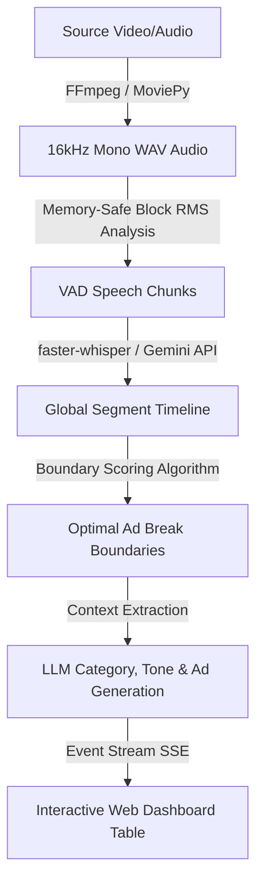

# PRESIDENCY UNIVERSITY
**School of Artificial Intelligence & Advanced Computing**

<br>

<div align="center">
  <strong>AI Centre of Excellence</strong>
  <br>
  <em>Accelerated by NVIDIA</em>
</div>

<br><br>

# NVIDIA ACCELERATED AI CENTRE OF EXCELLENCE
## Final Internship and Project Report

<br><br>

| Field | Details |
| :--- | :--- |
| **PROJECT REPORT TITLE** | AUTOMATED VIDEO AD-MARKER & CONTEXTUAL PROMPT GENERATOR |
| **STUDENT NAME** | LAALIKA J |
| **ROLL NUMBER / ID** | 20241CAI0231 |
| **BRANCH & DEPARTMENT** | B-TECH School of Artificial Intelligence & Advanced Computing |
| **START DATE & END DATE** | 29-06-2026 TO 10-07-2026 |
| **PROJECT SUBMISSION** | 11-07-2026 |

<br><br>

---

## 1. About NVIDIA Corporation

NVIDIA Corporation, founded in 1993 by Jen-Hsun Huang, Chris Malachowsky, and Curtis Priem, is a pioneer in graphics processing unit (GPU) accelerated computing. Originally focused on bringing 3D graphics to the gaming and multimedia markets, NVIDIA invented the GPU in 1999, redefining modern computer graphics and sparking the growth of the PC gaming market. Over the next two decades, NVIDIA expanded its scope, transforming the GPU from a specialized 3D rendering chip into a highly programmable parallel processor capable of general-purpose scientific computing.

Today, NVIDIA stands at the absolute vanguard of the Artificial Intelligence revolution. By recognizing the immense mathematical alignment between deep learning algorithms and parallel hardware architectures, the company made a massive, long-term strategic bet on AI supercomputing. Through the development of the proprietary CUDA compute platform, NVIDIA created a fully integrated stack of software libraries, hardware drivers, and deep learning engines that became the standard for researchers and developers globally. In 2024, NVIDIA joined the ranks of the world's most valuable companies, crossing a $3 trillion market capitalization milestone. Its compute platforms have become the foundation of almost all major generative AI foundations, large language models (LLMs), autonomous vehicle systems, and scientific supercomputing centers around the world.

---

## 2. NVIDIA H200 Tensor Core GPU

Released in Q2 2024, the NVIDIA H200 Tensor Core GPU is the successor to the groundbreaking H100, designed specifically to address the massive memory and bandwidth bottlenecks of generative AI and large-scale model inference. Built on the Hopper architecture, the H200 is the first GPU to deploy ultra-fast HBM3e (High Bandwidth Memory 3e) technology. By packing 141 GB of HBM3e memory running at a staggering 4.8 terabytes per second (TB/s), the H200 provides double the capacity and 1.4x the bandwidth of its predecessor. This enables it to store massive language models entirely inside active GPU memory, dramatically reducing latency and maximizing computing efficiency.

| SPECIFICATION | NVIDIA H100 GPU | NVIDIA H200 GPU (NEW) |
| :--- | :--- | :--- |
| **Architecture** | Hopper | Hopper (Upgraded Silicon) |
| **Memory Type** | HBM3 | HBM3e (Advanced High Bandwidth) |
| **Memory Capacity** | 80 GB | 141 GB (Nearly Double) |
| **Memory Bandwidth** | 3.35 TB/s | 4.8 TB/s (1.4x Faster) |
| **FP8 Performance** | Approx. 4 PetaFLOPS | Approx. 4 PetaFLOPS |
| **LLM Inference Speed** | Baseline (1.0x) | Llama 2 (70B): 1.9x faster \| GPT-3: 1.6x faster |

---

## 3. Understanding the NVIDIA GPU Architecture

Graphics Processing Units (GPUs) differ fundamentally from Central Processing Units (CPUs) in their computational philosophy. A CPU is designed for sequential processing and low-latency serial tasks, utilizing a few powerful cores optimized for single-threaded speed. Conversely, a GPU is built for massive parallel execution, containing thousands of smaller, simpler cores that work simultaneously. This makes GPUs uniquely suited for tasks like 3D graphics rendering, computer vision, and matrix math operations — which form the foundational operations of deep learning.

### Key Architectural Sub-systems of NVIDIA GPUs:

* **CUDA Cores**: The fundamental parallel processors that execute basic mathematical calculations and logic instructions on the GPU.
* **Tensor Cores**: Specialized hardware units introduced in the Volta architecture designed to perform fast mixed-precision matrix multiplication in a single cycle. These are the engines that accelerate Transformer models and LLM operations.
* **Streaming Multiprocessors (SM)**: The primary building blocks of the GPU. Each SM groups CUDA cores, Tensor cores, register files, and shared memory cache to coordinate execution.
* **NVLink Interconnect**: NVIDIA's proprietary high-bandwidth interconnect, allowing multiple GPUs to communicate at speeds up to 900 GB/s, enabling them to act as a single massive virtual GPU.

---

## 4. Project Work Timeline: Day 1 to Day 10

* **Day 1: Introduction to NVIDIA GPU and Kubernetes Pods and Services**
  * Understood about NVIDIA H-200 GPU and its features.
  * Creation of Pods and services & how it connects to the NVIDIA Server.
* **Day 2: Introduction to Machine Learning and Model Training**
  * Understood Core Machine Learning Concepts.
  * Performed a program to train a model by following the Model Training Pipeline.
* **Day 3: Supervised and Unsupervised Machine Learning Concepts**
  * Focused and understood programs based on Classification & Regression.
* **Day 4: Neural Networks: CNN and RNN**
  * Focused on creating Neural Networks and trained a model based on the MNIST dataset.
* **Day 5: Working Natural Language Processing Pipeline for a Model**
  * Understood NLP Pipeline and Types of NLP.
  * Focused on training a model following every step of the NLP pipeline.
* **Day 6: Transformers and Types of Transformer (BERT & GPT)**
  * Understood Transformers and types of transformers used to train a model.
  * Understood concepts like BERT and GPT and focused on training models that use these concepts.
* **Day 7: Large Language Models**
  * Understood the importance of LLMs in Machine Learning.
  * Focused on programs that used Google Gemini and compared other LLMs with Google Gemini.
* **Day 8: VIVA about Concepts Covered and Project Selection**
  * VIVA about all the concepts that were covered till Day 7.
  * Implementing a project based on the concepts we understood.
* **Day 9: Working of Diffusion Models and Generative Adversarial Networks**
  * Understood how Diffusion Models work and types of Diffusion Models.
  * Implemented programs that use diffusion models.
  * Focused on training a model using GAN and generated outputs.
* **Day 10: Working on Final Internship Project**
  * Focused on completing our Final Internship Project.

---

## 5. Project Details: AdMarker Engine

The **AdMarker Engine** is an automated pipeline and professional web dashboard designed to identify optimal quiet-zones (silent pauses) in audio or video timelines and leverage Large Language Models (LLMs) to perform semantic categorization and targeted product ad recommendations. 

Placing advertisements at random timestamps (e.g. every 5 minutes) highly disrupts the viewer's experience. By finding natural conversational boundaries and semantic breaks, the AdMarker Engine inserts advertisements precisely when a topic concludes or during a prolonged pause, maximizing ad retention while preserving user engagement.

### How the System Uses Large Language Models (LLMs):

1. **Structured Transcription via Gemini REST API**:
   The system converts raw video files into structured audio segments. When using the Gemini transcription provider, raw audio is chunked, converted to base64, and sent to Google Gemini via a direct REST API call. By supplying a target JSON output schema, the LLM performs precise speech-to-text alignment, returning an array of segments with start, end, and transcribed text.
2. **Contextual Tagging & Tone Inferences**:
   After finding optimal breaks, the system gathers the preceding 30 seconds of conversational transcript. This context is sent to a Gemini or Hugging Face model to classify the primary topic (e.g., Technology, Culinary, Automotive, Finance) and infer the overall tone of discussion (e.g., Professional, Warm & Instructional, Hands-on, Analytical).
3. **Targeted Ad Recommendation Engine**:
   Based on the inferred topic and tone, the LLM acts as a recommendation agent, suggesting 2–3 highly relevant, non-disruptive products or services. For example, a segment discussing database clustering results in recommendations for high-performance serverless cloud hosting or security audit tools.

### Core Processing Stages:



1. **Audio Extraction**: Converts input videos (MP4/MOV) into high-fidelity 16kHz mono WAV streams using `moviepy` or a fallback `ffmpeg` command-line subprocess.
2. **Voice Activity Detection (VAD)**: Scans the WAV file block-by-block (100ms blocks) to calculate Root Mean Square (RMS) energy. It splits audio into speech chunks (20-30s) based on silence thresholds, ensuring memory remains flat regardless of video length.
3. **Stitched Transcription**: Transcribes chunks using a local Faster-Whisper model or Google Gemini, mapping chunk-relative segments back to the global timeline.
4. **Boundary Scoring**: A scoring heuristic processes the timeline gaps. Gaps are rewarded based on duration, with a large weight (+3.0) added if the preceding segment ends with sentence-ending punctuation (`.`, `?`, `!`) or a clause boundary (`,`, `;`, `:`).
5. **Contextual Recommendation**: The preceding context is analyzed by the LLM to generate targeted product ads.
6. **Streaming API & Frontend**: A multi-threaded python server spawns the execution and streams console output logs to the browser in real-time using Server-Sent Events (SSE). The dashboard displays interactive states, progress stages, and a final recommendation table.

---

## 6. Code snippets

### Snippet 1: Memory-Safe Voice Activity Detection (VAD) Block Reading (audio.py)
* **Purpose**: Reads large WAV audio files block-by-block (100ms segments) to compute RMS energy. It keeps the system's memory flat and identifies silence periods to divide speech into 20–30 second chunks.

```python
# Read WAV block-by-block and compute RMS to check silence
with sf.SoundFile(audio_path) as f:
    while True:
        block = f.read(block_samples, dtype='float32')
        if len(block) == 0:
            break
        rms = np.sqrt(np.mean(block ** 2)) if len(block) > 0 else 0.0
        is_silent = rms < energy_threshold
        current_chunk_blocks.append((block, rms))
        
        # Track silence hangover
        consecutive_silence = (consecutive_silence + 1) if is_silent else 0
        current_len = len(current_chunk_blocks) * block_len_sec
```

### Snippet 2: Boundary Scoring and Context Extraction (analyzer.py)
* **Purpose**: Evaluates the silent pauses between speech chunks. It rewards longer pauses and gives a heavy weight (+3.0 score) if the segment before the pause ends in a full sentence (., ?, !) or clause (,, ;, :), ensuring ad breaks are placed at natural conversational transitions.

```python
# Score silent gaps based on duration and ending punctuation
for i in range(len(segments) - 1):
    current_seg, next_seg = segments[i], segments[i+1]
    gap_duration = next_seg["start"] - current_seg["end"]
    
    if gap_duration >= self.min_gap_seconds:
        score = gap_duration
        text_clean = current_seg["text"].strip()
        
        # Reward completed sentence boundaries (+3.0) or clauses (+1.0)
        if text_clean and text_clean[-1] in ('.', '?', '!'):
            score += 3.0
        elif text_clean and text_clean[-1] in (',', ';', ':'):
            score += 1.0
```

### Snippet 3: Google Gemini API REST Integration for Contextual Tagging (llm.py)
* **Purpose**: Queries the Gemini API with structured output schema generation configuration to force a clean, parser-friendly JSON response containing categories, tones, and ad suggestions.

```python
# Query Google Gemini API via REST with structured output schema configuration
url = f"https://generativelanguage.googleapis.com/v1beta/models/gemini-2.5-flash-lite:generateContent?key={self.gemini_api_key}"
payload = {
    "contents": [{"parts": [{"text": self._get_prompt(context_text)}]}],
    "generationConfig": {
        "responseMimeType": "application/json",
        "responseSchema": {
            "type": "OBJECT",
            "properties": {"category": {"type": "STRING"}, "tone": {"type": "STRING"}, "ad_suggestions": {"type": "ARRAY", "items": {"type": "STRING"}}},
            "required": ["category", "tone", "ad_suggestions"]
        },
        "temperature": 0.1
    }
}
response = requests.post(url, headers={"Content-Type": "application/json"}, json=payload)
```

### Snippet 4: Asynchronous Pipeline Execution and SSE Log Streaming (web_server.py)
* **Purpose**: This API endpoint spawns the Python processing script in a subprocess, intercepts standard output, cleans ANSI codes, and streams logs in real-time to the client using Server-Sent Events (SSE).

```python
# Spawn python processing subprocess and stream stdout logs back to client using SSE
process = subprocess.Popen(cmd, stdout=subprocess.PIPE, stderr=subprocess.STDOUT, text=True, bufsize=1)
ansi_escape = re.compile(r'\x1B(?:[@-Z\\-_]|\[[0-?]*[ -/]*[@-~])')

for line in process.stdout:
    clean_line = ansi_escape.sub('', line)
    if clean_line.strip() == "" and line.strip() == "":
        continue
    log_payload = json.dumps({"log": clean_line})
    self.wfile.write(f"data: {log_payload}\n\n".encode('utf-8'))
    self.wfile.flush()
process.wait()
```

---

## 7. System Output & Dashboard Screenshots

Below are the detailed descriptions and layouts of the operational states of the AdMarker Engine dashboard.

### State 1: Professional File Uploader & Configuration Panel
This state displays the home layout of the dashboard featuring a glassmorphic drag-and-drop zone. Users can select an MP4 video or WAV audio file, choose between Google Gemini and faster-whisper for transcription, configure context tagging models, and adjust the minimum silent gap threshold via an interactive slider.


---

### State 2: Asynchronous Process Tracker & Live Event Log
When the pipeline starts, the system monitors each phase. The dashboard reflects the stage completion in real-time while streaming stdout lines from the backend into a retro terminal log console via Server-Sent Events (SSE).


---

### State 3: Segment Timeline & AI-Generated Ad Recommendations Table
Upon pipeline completion, the results table presents the final identified quiet-zones, timestamps, and targeted ad recommendations.


